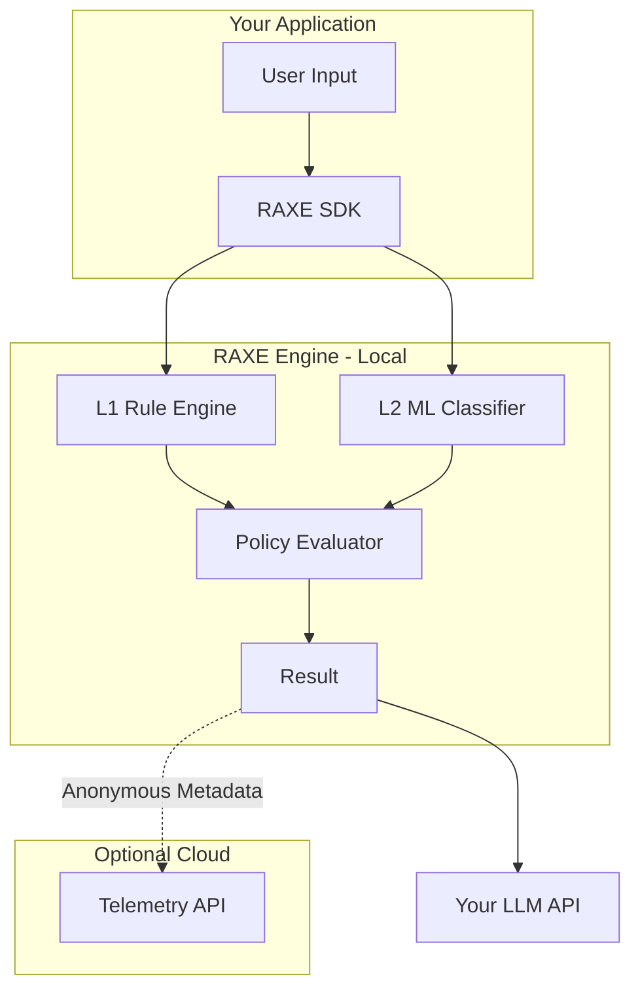

## Design Principles

RAXE is built on three core principles:

1. **Privacy by Architecture** - All scanning happens locally
2. **Domain Purity** - Core logic has zero I/O
3. **Transparency** - Open rules, verifiable behaviour

## System Overview



## Clean Architecture Layers

RAXE follows Clean/Hexagonal Architecture:

```
┌─────────────────────────────────────────────────┐
│  CLI / SDK Layer (Entry Points)                 │
│  • cli/        - Click commands                 │
│  • sdk/        - Python SDK                     │
└────────────────────┬────────────────────────────┘
                     ↓
┌─────────────────────────────────────────────────┐
│  Application Layer (Orchestration)              │
│  • scan_pipeline.py     - Main flow             │
│  • apply_policy.py      - Policy logic          │
│  • telemetry_manager.py - Telemetry             │
└────────────────────┬────────────────────────────┘
                     ↓
┌─────────────────────────────────────────────────┐
│  Domain Layer (PURE - NO I/O)                   │
│  • engine/    - Detection execution             │
│  • rules/     - Rule models                     │
│  • ml/        - ML detection                    │
│  • policies/  - Policy evaluation               │
└────────────────────┬────────────────────────────┘
                     ↓
┌─────────────────────────────────────────────────┐
│  Infrastructure Layer (I/O)                     │
│  • database/   - SQLite                         │
│  • config/     - YAML loading                   │
│  • telemetry/  - HTTP client                    │
└─────────────────────────────────────────────────┘
```

## Privacy Architecture

### What Stays Local

| Data | Location | Never Leaves |
|------|----------|--------------|
| Raw prompts | Memory only | Yes |
| Matched text | Memory only | Yes |
| Rule patterns | Local files | Yes |
| Scan history | Local SQLite | Yes |

### What's Sent (Telemetry)

```json
{
  "api_key": "raxe_...",
  "prompt_hash": "sha256:...",
  "rule_id": "pi-001",
  "severity": "high",
  "confidence": 0.95,
  "scan_duration_ms": 4.2
}
```

**Never sent:** Raw prompts, matched text, user content, rule patterns

## Scan Pipeline

```python
# Simplified scan flow
def scan(prompt: str) -> ScanResult:
    # 1. Load rules (infrastructure)
    rules = rule_loader.load()

    # 2. L1 detection (domain - pure)
    l1_detections = detector.detect(prompt, rules)

    # 3. L2 detection (domain - pure)
    l2_result = ml_classifier.classify(prompt)

    # 4. Merge results (domain - pure)
    combined = merger.merge(l1_detections, l2_result)

    # 5. Apply policies (domain - pure)
    final = policy_evaluator.apply(combined)

    # 6. Record telemetry (infrastructure)
    telemetry.record(final)

    return final
```

## Offline Mode

RAXE works 100% offline:

```python
from raxe import Raxe

# No network required
raxe = Raxe(telemetry=False)
result = raxe.scan("test prompt")
```

All rules and ML models are bundled with the package.

## What's Next

<CardGroup cols={2}>
  <Card title="Detection Engine" icon="magnifying-glass" href="/concepts/detection-engine">
    Deep dive into L1 and L2 detection
  </Card>
  <Card title="Policies" icon="shield" href="/concepts/policies">
    Configure enforcement policies
  </Card>
</CardGroup>
