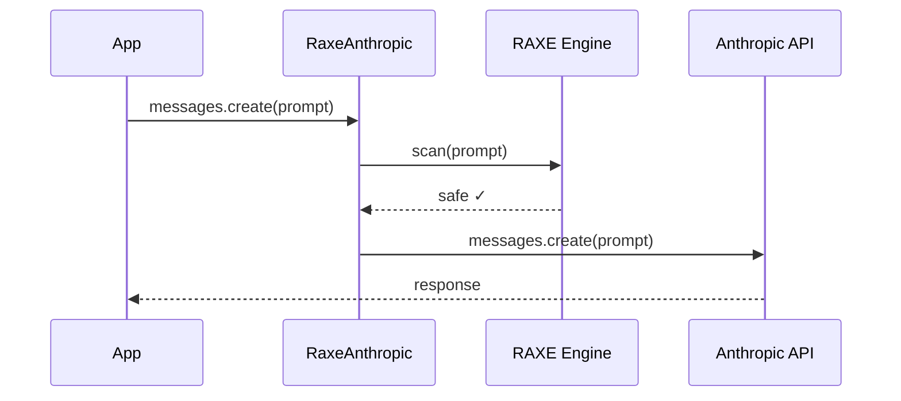

<Info>New to RAXE? Start with the [Quickstart](/quickstart) and learn [how detection works](/concepts/detection-engine).</Info>

## Installation

```bash
pip install raxe[wrappers]
```

## Basic Usage

<CardGroup cols={3}>
  <Card title="Drop-In Replacement" icon="arrow-right-arrow-left">
    Replace `Anthropic()` with `RaxeAnthropic()` — one line change
  </Card>
  <Card title="Automatic Scanning" icon="shield-check">
    Every message scanned before reaching the model
  </Card>
  <Card title="Zero Latency Impact" icon="bolt">
    Sub-millisecond L1 scanning adds negligible overhead
  </Card>
</CardGroup>

```python title="basic.py"
from raxe import RaxeAnthropic

# Drop-in replacement for Anthropic client
client = RaxeAnthropic(api_key="sk-ant-...")

# Threats automatically scanned before API call
response = client.messages.create(
    model="claude-sonnet-4-20250514",
    max_tokens=1024,
    messages=[{"role": "user", "content": "What is AI?"}]
)

print(response.content[0].text)
```

## How It Works

1. User sends request through `RaxeAnthropic`
2. RAXE scans the prompt **before** calling Anthropic
3. If threat detected → `RaxeBlockedError` raised
4. If safe → Request forwarded to Anthropic
5. Response returned normally



## Error Handling

```python title="error_handling.py"
from raxe import RaxeAnthropic, RaxeBlockedError, RaxeException

client = RaxeAnthropic(api_key="sk-ant-...")

try:
    response = client.messages.create(
        model="claude-sonnet-4-20250514",
        max_tokens=1024,
        messages=[{"role": "user", "content": user_input}]
    )
    return response.content[0].text

except RaxeBlockedError as e:
    # Threat was detected and blocked before API call
    print(f"Blocked: {e.severity}")
    print(f"Rule: {e.rule_id}")
    return "Your request was blocked for security reasons."

except RaxeException as e:
    # Other RAXE errors (config, initialization)
    logger.error(f"RAXE error: {e}")
    # Decide: fail open or fail closed
```

## Configuration

```python title="config.py"
from raxe import RaxeAnthropic

client = RaxeAnthropic(
    api_key="sk-ant-...",

    # RAXE configuration
    raxe_l1_enabled=True,        # Enable rule-based detection (515+ patterns)
    raxe_l2_enabled=True,        # Enable ML detection (neural classifier)
    raxe_block_on_threat=True,   # Raise RaxeBlockedError on threat detection
)
```

## Streaming Support

```python title="streaming.py"
from raxe import RaxeAnthropic

client = RaxeAnthropic(api_key="sk-ant-...")

# Streaming works normally - prompt scanned before stream starts
with client.messages.stream(
    model="claude-sonnet-4-20250514",
    max_tokens=1024,
    messages=[{"role": "user", "content": user_input}]
) as stream:
    for text in stream.text_stream:
        print(text, end="", flush=True)
```

## System Prompts

System prompts are also scanned:

```python title="system_prompts.py"
response = client.messages.create(
    model="claude-sonnet-4-20250514",
    max_tokens=1024,
    system="You are a helpful assistant",  # Scanned
    messages=[
        {"role": "user", "content": "Hello"}  # Scanned
    ]
)
```

## All Messages Scanned

The wrapper scans **all messages** in the conversation:

```python title="multi_turn.py"
response = client.messages.create(
    model="claude-sonnet-4-20250514",
    max_tokens=1024,
    messages=[
        {"role": "user", "content": "What is AI?"},        # Scanned
        {"role": "assistant", "content": "AI is..."},      # Scanned
        {"role": "user", "content": "Tell me more"}        # Scanned
    ]
)
# All messages combined and scanned for threats
```

## Migration Guide

```python title="migration.py"
# Before - standard Anthropic client
from anthropic import Anthropic
client = Anthropic(api_key="sk-ant-...")

# After - one import change, full protection
from raxe import RaxeAnthropic
client = RaxeAnthropic(api_key="sk-ant-...")

# Everything else stays the same - full API compatibility!
```

## Async Support

```python title="async.py"
from raxe import AsyncRaxeAnthropic

# Async client for high-throughput applications
client = AsyncRaxeAnthropic(api_key="sk-ant-...")

response = await client.messages.create(
    model="claude-sonnet-4-20250514",
    max_tokens=1024,
    messages=[{"role": "user", "content": "Hello"}]
)
```

## What's Next

<CardGroup cols={2}>
  <Card title="Production Checklist" icon="list-check" href="/guides/production-checklist">
    Deploy RAXE safely to production
  </Card>
  <Card title="Async SDK" icon="bolt" href="/sdk/async">
    High-throughput scanning with async support
  </Card>
</CardGroup>
