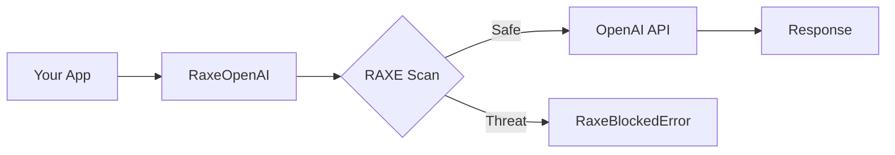

<Info>New to RAXE? Start with the [Quickstart](/quickstart) and learn [how detection works](/concepts/detection-engine).</Info>

## Installation

```bash
pip install raxe[wrappers]
```

## Basic Usage

```python title="basic.py"
from raxe import RaxeOpenAI

# Drop-in replacement for OpenAI client
client = RaxeOpenAI(api_key="sk-...")

# Threats automatically scanned before API call
response = client.chat.completions.create(
    model="gpt-4",
    messages=[{"role": "user", "content": "What is AI?"}]
)

print(response.choices[0].message.content)
```

## How It Works

1. User sends request through `RaxeOpenAI`
2. RAXE scans the prompt **before** calling OpenAI
3. If threat detected → `RaxeBlockedError` raised
4. If safe → Request forwarded to OpenAI
5. Response returned normally



## Benefits

<CardGroup cols={2}>
  <Card title="Save Money" icon="dollar-sign">
    Threats blocked before API call - no wasted tokens
  </Card>
  <Card title="Zero Code Changes" icon="code">
    Just change the import statement
  </Card>
  <Card title="Full Compatibility" icon="check">
    All OpenAI features work normally
  </Card>
  <Card title="Automatic Protection" icon="shield">
    Every request scanned automatically
  </Card>
</CardGroup>

## Error Handling

```python title="error_handling.py"
from raxe import RaxeOpenAI, RaxeBlockedError, RaxeException

client = RaxeOpenAI(api_key="sk-...")

try:
    response = client.chat.completions.create(
        model="gpt-4",
        messages=[{"role": "user", "content": user_input}]
    )
    return response.choices[0].message.content

except RaxeBlockedError as e:
    # Threat was detected and blocked before API call
    print(f"Blocked: {e.severity}")
    print(f"Rule: {e.rule_id}")
    return "Your request was blocked for security reasons."

except RaxeException as e:
    # Other RAXE errors (config, initialization)
    logger.error(f"RAXE error: {e}")
    # Decide: fail open or fail closed
```

## Configuration

```python title="config.py"
from raxe import RaxeOpenAI

client = RaxeOpenAI(
    api_key="sk-...",

    # RAXE configuration
    raxe_l1_enabled=True,        # Enable rule-based detection (515+ patterns)
    raxe_l2_enabled=True,        # Enable ML detection (neural classifier)
    raxe_block_on_threat=True,   # Raise RaxeBlockedError on threat detection
)
```

## Streaming Support

```python title="streaming.py"
from raxe import RaxeOpenAI

client = RaxeOpenAI(api_key="sk-...")

# Streaming works normally - prompt scanned before stream starts
stream = client.chat.completions.create(
    model="gpt-4",
    messages=[{"role": "user", "content": "Tell me a story"}],
    stream=True  # Full OpenAI streaming support
)

for chunk in stream:
    if chunk.choices[0].delta.content:
        print(chunk.choices[0].delta.content, end="")
```

## All Messages Scanned

The wrapper scans **all messages** in the conversation:

```python title="multi_turn.py"
response = client.chat.completions.create(
    model="gpt-4",
    messages=[
        {"role": "system", "content": "You are helpful"},  # Scanned
        {"role": "user", "content": "What is AI?"},        # Scanned
        {"role": "assistant", "content": "AI is..."},      # Scanned
        {"role": "user", "content": "Tell me more"}        # Scanned
    ]
)
# All messages combined and scanned for threats
```

## Migration Guide

```python title="migration.py"
# Before - standard OpenAI client
from openai import OpenAI
client = OpenAI(api_key="sk-...")

# After - one import change, full protection
from raxe import RaxeOpenAI
client = RaxeOpenAI(api_key="sk-...")

# Everything else stays the same - full API compatibility!
```

## Async Support

```python title="async.py"
from raxe import AsyncRaxeOpenAI

# Async client for high-throughput applications
client = AsyncRaxeOpenAI(api_key="sk-...")

response = await client.chat.completions.create(
    model="gpt-4",
    messages=[{"role": "user", "content": "Hello"}]
)
```

## What's Next

<CardGroup cols={2}>
  <Card title="Production Checklist" icon="list-check" href="/guides/production-checklist">
    Deploy RAXE safely to production
  </Card>
  <Card title="Async SDK" icon="bolt" href="/sdk/async">
    High-throughput scanning with async support
  </Card>
</CardGroup>
